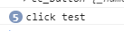

# 代码使用cc.Button

> 知识大纲
1. 代码添加/获取cc.Button组件;
2. 代码里面添加按钮的响应事件;
3. 代码触发按钮指定的回调函数;

> 练习
1. 获得button组件的几种方法
    1. 放在properties，即放在编辑器里，然后把图片拖拽过去！(直接在编辑器里做)
        ```
        properties: {
                        button: {
                            type: cc.Button,
                            default: null
                        }
                    },
        ```
        
        
        
    2. 通过API获取 
        ```
        onLoad () {
            this.start_btn = this.node.getChildByName("ks_up").getComponent(cc.Button);
            console.log(this.start_btn);
        },
        ```    

2. 添加button组件/添加按钮的响应事件
    1. 新建个单色精灵，取名item，改为红色，
        任意拖拽个位置，不和之前的button重叠就可以了，方便看到 
        
        
        
    2. 来人上代码     
        ```
        on_red_btn_click(e, custom){
            console.log("click", custom);
        },
    
        // LIFE-CYCLE CALLBACKS:
    
        onLoad () {
            /*this.start_btn = this.node.getChildByName("ks_up").getComponent(cc.Button);
            console.log(this.start_btn);*/
    
            //添加Button组件
            this.red_btn = this.node.getChildByName("item").addComponent(cc.Button);
            //添加一个响应函数
            let clickEvent = new cc.Component.EventHandler();
            clickEvent.target = this.node;
            clickEvent.component = "game_scene";
            clickEvent.handler = "on_red_btn_click";
            clickEvent.customEventData = "test";
            this.red_btn.clickEvents.push(clickEvent);
    
        },
        ```
    3. 运行
    
        
        
 3. 代码触发按钮指定的回调函数
    1. 简单解释下，就类似trigger，不是真实点击但触发按钮点击事件，
        比方说用键盘按下回车，触发了点击事件
    2. 我们这边用定时器演示
        ```
        //定时器触发点击事件
        this.scheduleOnce(function(){
            //先获取button上的点击事件
            let click_events = this.red_btn.clickEvents;
            for(let i = 0; i < click_events.length; i ++){
                let handle = click_events[i];
                handle.emit(["","这里是定时器触发的"]);
            }
        }.bind(this), 2)
        ``` 
        
                         