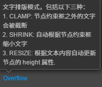

# cc.Label

> 知识大纲
1. cc.Label是显示文字的组件
2. cc.Label属性面板
    1. String: 文本显示的内容; 
    2. Horizontal: 水平对齐的方式: 左 右 居中; 
    3. Vertical: 上, 下, 居中, 字与行的排版; 
    4. Font Size: 字体大小; 
    5. LineHeight: 每行的高度; 
    6. OverFlow:文字排版
        1. None: 没有任何特性; Clamp: 截断; 
        2. Shank:自动缩放到节点大小;  Resize Height: 根据宽度自动折行;
    7. Font: ttf字库文件, 位图字体字库文件 
    8. Font Family: 字体家族,使用系统的哪种字库;
    9. Use System Font: 是否使用系统字体;
3. Label节点所在的锚点修改;

> 练习
1. 创建Label
    * 通过菜单创建Label节点(2种方式)
        1. 在Canvas下右键，创建节点-->创建渲染节点-->Label,并改名为sys_label
        2. 在Canvas下右键，创建空节点,然后在右侧属性检查器中，添加Label组件，并改名为num_label        
2. Label属性面板
    * 和css一些属性类似，这里部分很简单的属性就不做赘述，参考知识大纲的说明         
    * overflow的属性大家在编辑器操作下就知道具体什么意思了，详细说明也看知识大纲，
        这边在截一张编辑器的图
        
        
        
    * Font
        1. 这里有个选项**Use System Font**，使用系统自带的字库 
        2. **Font Family**只有在勾选上系统字库后才有这个选项可以选择，意思就是你现在用的是系统字库的哪个
        3. Font选项是选择自己自定义的字库[点击这里，学习](./02-自定义字库.md)
3. Label锚点
    * 改变锚点主要是用来做各种对齐
    * 默认锚点在(0.5,0.5)就是正中间，所以字符串修改长度变长的时候就是往两边伸展
    * 我们可以把锚点的x坐标改为0或者1，然后改变字符串，小伙伴自行测试这个效果