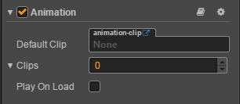
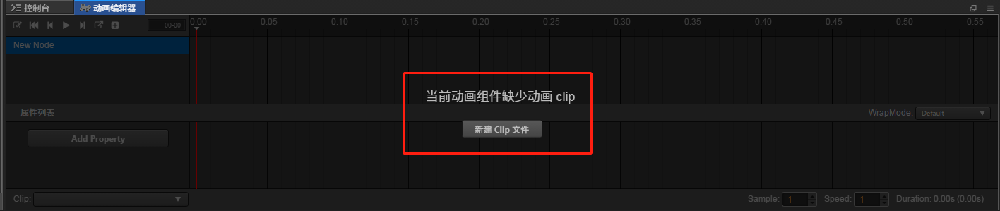
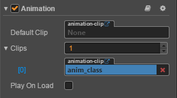
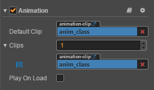
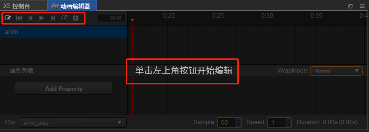
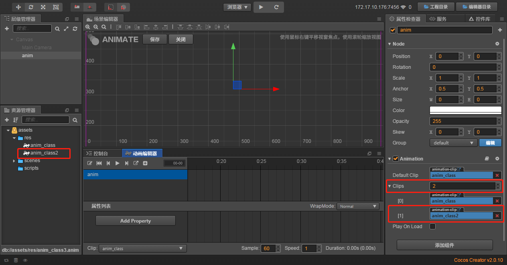
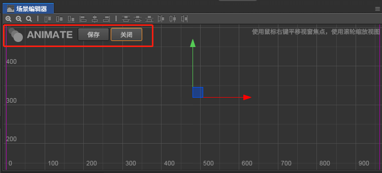

# 动画编辑器使用

> 知识大纲
1. 创建一个节点;
2. 为这个节点添加一个动画组件 cc.Animation;
3. 为这个动画组件新建一个动画文件 --> AnimationClip对象;
4. cc.Animation 控制面板的属性:
     * default: 默认的播放的动画剪辑;
     * Clips: 动画剪辑的数组集合
     * Play onLoad: 是否在加载的时候开始播放;
     
> 练习
1. 在Canvas下创建一个空节点，取名为anim
2. 点击右侧属性检查器，添加组件-->其他组件-->Animation 

     
    
3. 点击控制台右侧的动画编辑器，点击新建Clip文件 

          
    
4. 在res里面新建个**anim_class**，点击保存

    
    
    
    
5. 这个时候看属性检查器中Animation组件的Clip属性，就有我们前面新建的**anim_class**啦

    
    
6. 这里很容易发现，Clips对应的是个数组，所以可以创建多个clip，
    然后default属性必然就是默认选择哪个clip播放
    
    * 我们把anim_class拖拽至**Default Clip**中 
    
           
    
7. 我们这边可以在添加个clip，演示下如何添加新的clip
    * 我们看动画编辑器，有信息提示 
    
              
        
    * 上图中红色框圈出来的最右边的那个按钮可以新建一个新的clip，我们点击创建，
        和之前创建clip的方式一样，这次取名为anim_class2 
        
           
        
    * 我们可以在建一个anim_class3,这边就不在赘述截图说明了    
    
8. 动画编辑器左下方可以选择编辑哪个clip，场景编辑器左上方有保存关闭按钮

    
    
        
    
9. **Play On Load**勾选就是播放默认的clip      
            

        
    
