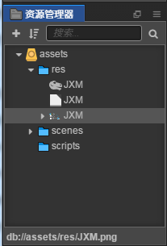

# spine骨骼动画工具

> 知识大纲
1. 骨骼动画: 把动画打散, 通过工具，调骨骼的运动等来形成动画
2. spine是一个非常流行的2D骨骼动画制作工具
3. spine动画美术人员导出3个文件
    1. .png文件: 动画的”骨骼”的图片集
    2. .atlas文件: 每个骨骼在图片集里面位置，大小
    3. .json文件: 骨骼动画的animation控制文件,以及骨骼位置等信息
4. 骨骼动画导入: 直接把三个文件拷贝到项目的资源目录下即可
5. 使用骨骼动画:
    1. 直接拖动到场景
    2. 创建一个节点来添加sp.Skeleton组件  
    
> 练习
1. 把spine动画美术人员导出的三个文件放入res中

     
    
2. 创建方式有2种
    1. 拖动流   
        1. 把上图中res文件下第一个图标像骨头的JXM拖到Canvas节点下
        
            
            
        2. 图片看上去比较大，我们可以简单调整下位置和scale 
        
             
            
        3. 上图中我们还可以看到有一个sp.Skeleton组件，我们在下一节学习[点击此处学习](./02-sp.Skeleton.md)  
    2. 创建空节点添加流
        1. 在Canvas新建空节点，取名为spine
        2. 给spine添加组件，添加组件-->渲染组件-->Spine Skeleton 
        3. 然后把res里骨头图标的JXM拖拽至Spine Skeleton组件下的Skeleton Data属性下
        
            
     