# Mask组件

> 知识大纲
1. Mask组件是提供viewport功能的一个组件，你可以想象通过一个窗口去看外面的世界,
    只能看到这个窗口大小的视区;
2. Mask的形状: 矩形, 圆形, 图片的Alpha值来做mask;
3. 一个节点加上Mask组件后，它和它的孩子在这个范围内的会显示，不在这个范围内的不显示;

> 练习
1. 创建mask组件
    1. 我们把之前的预制体item都删了(可以使用active的属性隐藏)，然后在Canvas下创建个空节点，取名为**viewport**
    
        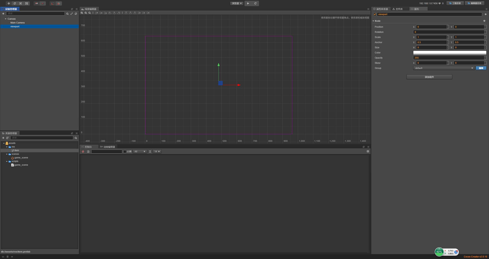
        
    2. 在viewport属性检查器中添加组件
        * 添加组件->渲染组件->Mask
        * 先简单地解释下，遮罩的孩子大小超出了遮罩的大小，那就只显示遮罩这块       
    3. 先来看下Mask组件的类型
    
        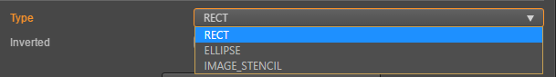
        
        1. RECT - 矩形
            * 我们先把res中的item拖拽至viewport下
                
                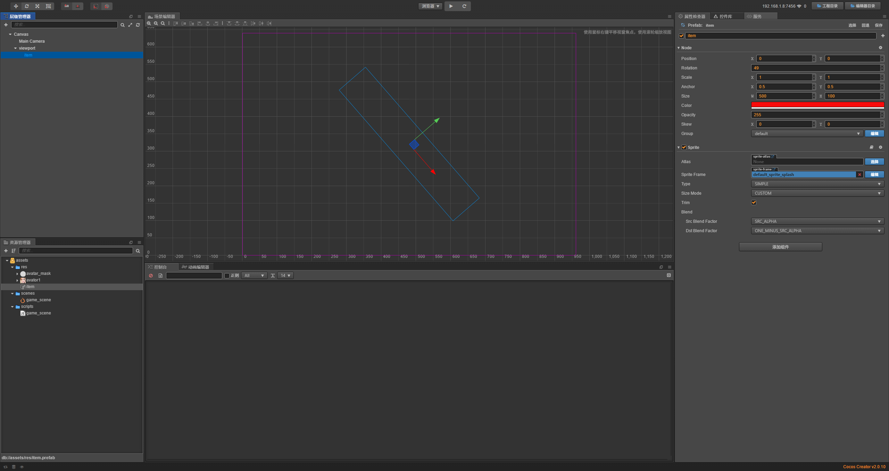
                
            * 然后修改viewport的size属性，比如都改为100
            
                
                
            * 我们还可以选中另外个属性**反向遮罩**
            
                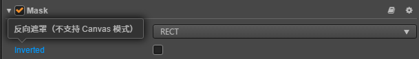 
                
                   
                
            * 这个看效果就能很清楚的知道什么是反向遮罩了  
        2. ELLIPSE - 椭圆
            * 主要说下Segements这个属性，这个属性直接操作起来更好理解，先看下默认值
            
                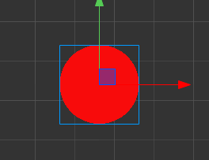
            
            * 首先size的大小和前面的矩形一样，然后这个属性填写的是个整数，
                最小值为3，我们一次往上加，然后截图看下效果
                
            * 属性值填3   
                
                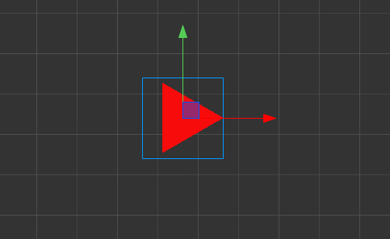
                 
            * 属性值填4    
                            
                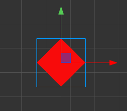
                 
            * 属性值填5    
                            
                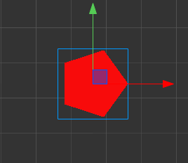
                 
            * 属性值填6    
                            
                
                 
            * 属性值填7    
                            
                
                
            * 所以填n就是n变形，然后默认值64足够大，
                就变成了圆形(因为我们的size宽高一样所以是圆，所以要椭圆遮罩怎么做你们知道了吧)                     
        3. IMAGE-STENCIL - 图片
            * 我们现在重新玩下，看下图片类型怎么玩，先来看下本身的图片样子
            
                
            
            * 把viewport下的item删除(可以使用active的属性隐藏)，然后在viewport下新增个单色精灵
            * 然后把素材图片**avatar1**拖拽至属性Sprite Frame下
            * 然后我们分别看下viewport属性的矩形，椭圆和图片
                1. 矩形
                    
                    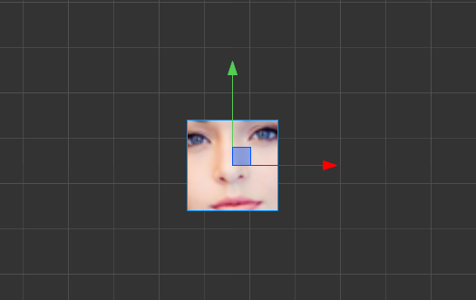
                    
                2. 椭圆
                    
                    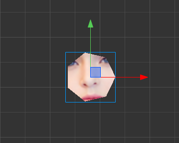
                    
                3. 图片
                
                    
                    
            * 现在没任何效果是因为我们还没有把素材中另外个**avatar_mask**
                拖拽到Mask中的图片类型的属性Sprite Frame中，现在拖拽吧！
                
                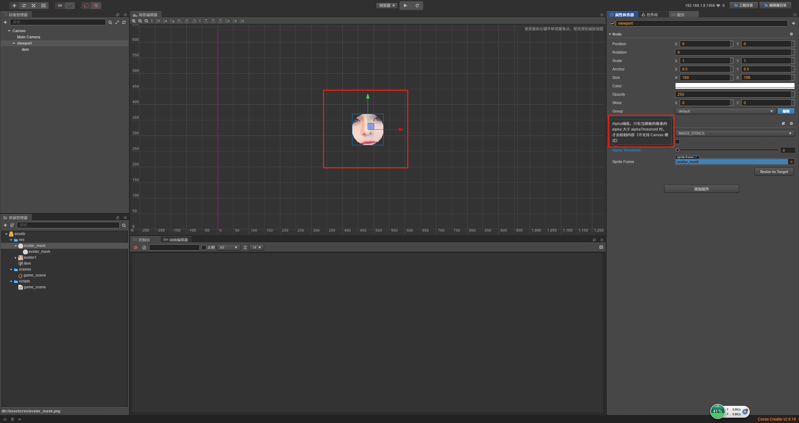
                
            * 然后小伙伴自行调戏这个阈值玩耍吧    