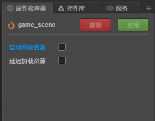

# 资源卸载

> 知识大纲
1. 每个场景有个自动释放资源
    * 勾选上这个场景的资源会自动释放
    * 不勾选上这个场景的资源不释放
2. 代码加载的资源，默认是不会受这个选项的影响的,
    除非设置cc.loader.setAutoRelease(url, boolean)
3. 手动释放资源
    * loadRes/ releaseRes  
    * load / release
    * releaseAsset (资源对象的object)
    
> 练习
1. 是否自动释放资源取决于是否勾选了自动释放
    * 我们在资源管理器点击**game_scene**,在右侧属性检查器中可以看到
        
        
        
    * 编辑器释放依赖的资源，代码里加载的资源默认是不会释放
2. 多查阅API练习     
    
        
            
        