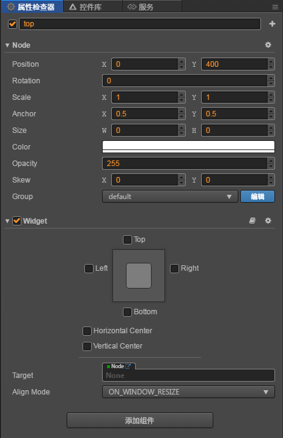
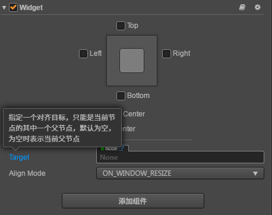
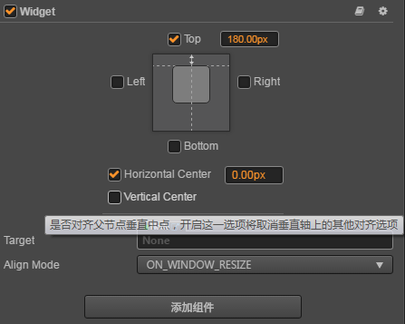
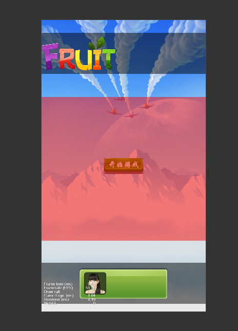

# cc.Widget组件

> 知识大纲
1. cc.Widget组件帮助解决停靠点的问题;
2. cc.Widget能帮助解决和父亲大小保持一致的问题;
3. 指定要相对的节点，必须是父节点或父亲以上的节点;

> 练习
1. 准备工作
    1. 在学习此小节前，请先完成这个简单的案例[点击此处](./05-creator界面适配案例.md)
    2. 如果完成第一步我们就开始学习对应的Widget知识吧
2. 开始练手
    1. 在前面的案例中，比如说我们要把top这个节点对于父亲Canvas，在位置上做些处理，就可以用到Widget组件
    2. 点击**top**，在右侧属性检查器中，添加组件->UI组件->Widget  
    
          
        
    3. 我们看下这个Target属性
    
        
        
    4. 所以我们这边的Target默认不填就是Canvas了，然后我们可以选中Top，就代表顶着父亲节点的最上方 
    5. 下面还有2个选中框，分别代表水平居中，垂直居中，小伙伴可以自行调试玩耍  
    
         
    
    6. 在给我们的bottom添加Widget组件，停靠在底部中间的位置
    7. 在给我们的center添加Widget组件，停靠在中心点位置
    8. 中间内容如何自动扩充填满
        1. 现在我们的top和bottom已经很好的处理了,但center部分还有些问题
        2. 现在模拟这个问题，我们在center下创建个单色精灵，取名为red，
            颜色改为红色半透明，宽度改为640，高度我们拖拽至top的底部和bottom的顶部 
            
            
            
        3. 用浏览器端运行 
            1. 机型先用default,看上去没什么问题
            
                
                
            2. 多换几个机型看下，会出现这样的情况 
            
                            
                
        4. 这就是前面说的center的问题，所以截下来我们看下如何解决
        5. 依然使用Widget组件，给red添加Widget组件,选中top，bottom并且target改为Canvas
        6. 如果target选用center是会有问题的因为center默认没大小，但强行用center也是可以的，
            那就要让center添加的Widget组件top，bottom，left，right都勾选上，这样center的大小也会和Canvas一样，
            所以也能达到一样的效果
    9. 运行调试，然后发现完美的解决了问题！！        