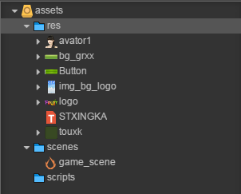
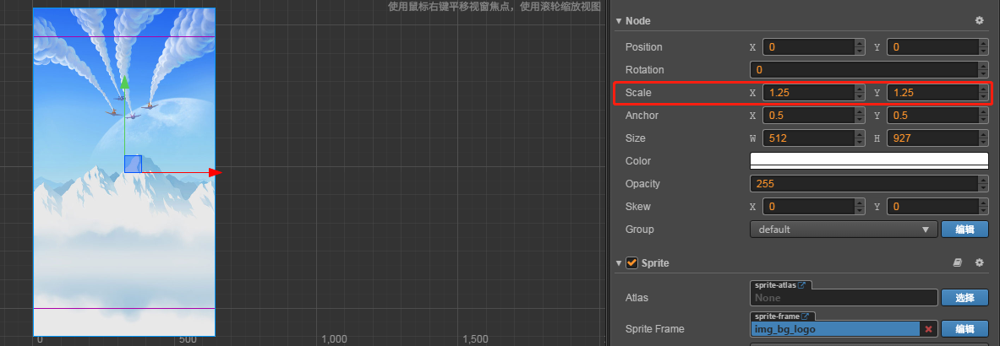
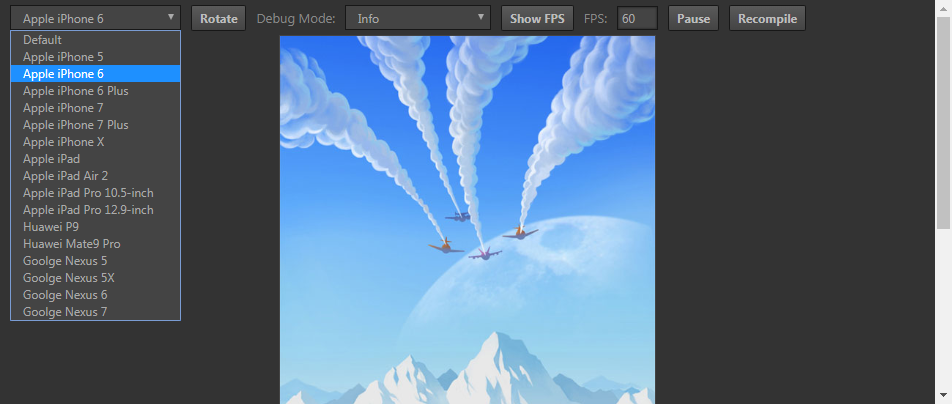
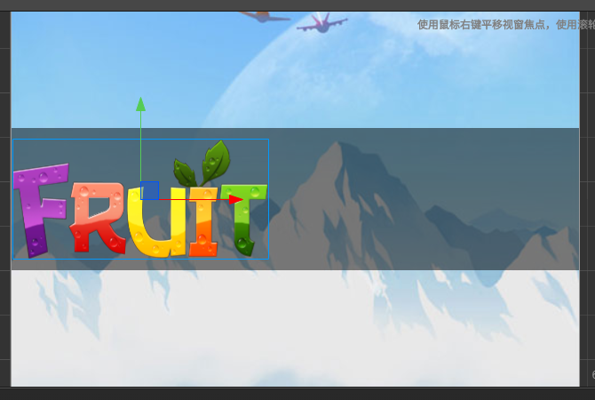
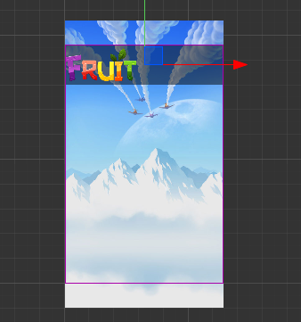
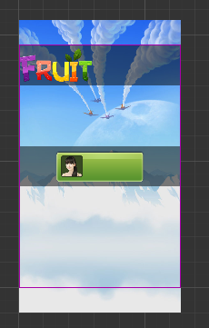

# creator界面适配案例 

> 知识大纲
1. 确定设计分辨率;
2. 配置适配策略;
3. 在设计分辨率下来搭建场景;
4. 决定界面上的停靠点,借助cc.Widget组件来实现;
5. 相对于父亲的区域大小;

> 练习
1. 准备工作
    1. 先将本次准备的素材，放入res文件夹中
    
        

    2. 设计分辨率改为640 * 960
    3. 使用固定宽度的策略
    
        
        
2. 开始玩耍
    1. 先将res中**img_bg_logo**拖拽至Canvas节点下
    
         
        
    2. 因为图片大小问题，看上去有点违和，我们调整下缩放的属性Scale，都改为1.25，
        我们会发现高度超出一点，后面会解释为什么要超出去一点   
    
        
        
    3. 在浏览器端运行看看，顺便调整机型看下是否适配  
    
         
        
    4. 因为宽度一致，高度比较大的机型看到的背景图就会多一点，
        这也就是为什么之前调整缩放比例，让高度超出的原因，
        为了能适配所有主流手机，这就是背景图的适配  
    
    5. 在Canvas下创建个空节点，取名为top
    6. 在top下创建个单色精灵取名bg，Size宽高改为(640,130),颜色改为半透明的黑色   
    
          
        
    7. 把res中的**logo**拖拽至top下，双击logo，把他拖拽放在单色精灵bg的左侧，注意y的值始终为0
        (这里发现单色精灵bg的高度太小改为160了)
    
        
        
        
        
    8. 我们把top的位置调整至上面，点击top，可以往上拖，也可以按方向键上，也可以直接改position的位置，
        注意position的x肯定是为0的，主要是y值的变化，这边我拖到了y值为400的地方
        
           
        
    9. 在Canvas下新建个空节点，取名为bottom，然后在bottom下也要搞这么个bg的单色精灵，
        这里我们就把前面的bg单色精灵复制到bottom下
        
    10. 把**bg_grxx**和**touxk**拖拽至bottom下 
        
    11. 把漂亮的小姐姐**avator1**拖拽至touxk下，并把size改为(80,80)
    
        
        
    12. 然后把头像继续往左边移动，注意y的值始终为0 
        
           
        
    13. 移动bottom的位置，移到底部，这里注意x的值始终为0，我移动的y的值是-370 
    
         
        
    14. 在Canvas新建个空节点，取名为center,现在层级管理器的结构及场景编辑器应该是这样的 
    
            
        
    15. 把res中的button拖拽至center下,然后给这个button添加个Button组件(添加组件->UI组件->Button)   
    
    16. 编辑上述的Button组件属性，**Transition**属性使用**Color**

    17. 拖拽res中的字体文件**STXINGKA**到层级管理器的Button下，然后修改Label的string属性，改为"开始游戏"，
        小伙伴们觉得字体太大可以适当改小，我之后又改成了30
    
         
        
    18. 在浏览器端运行看效果吧！！然后切换机型在看看效果  
    
             
        
    19. 我们会发现不同的机型布局上，top和bottom差别还是有的，这个时候就可以靠我们的停靠点解决问题
        [点击此处学习](./04-cc.Widget组件.md)    