# 碰撞检测系统 

> 知识大纲
1. creator有碰撞检测系统 + 物理碰撞系统，这个是两个独立的模块;
2. 给creator的游戏世界中的物体来进行分组，指定节点的分组与分组的碰撞矩阵;
3. 代码中获取节点的分组和分组索引: group与groupIndex;
4. 为每个节点添加碰撞检测区域-->碰撞器(物体形状), 编辑碰撞区域;
5. 代码开启碰撞检测系统(默认是关闭碰撞检测),开启和关闭碰撞检测的调试:
    ```
    let manager = cc.director.getCollisionManager(); 
    manager.enabled = true; // 开启碰撞
    manager.enabledDebugDraw = true; // 允许绘制碰撞的区域
    ```
6. 碰撞检测函数响应,发生碰撞检测的节点，会调用这个节点上所有组件的统一的三个接口:
     * onCollisionEnter: function (other, self) // 开始
     * onCollisionStay: function (other, self)  // 持续
     * onCollisionExit: function (other, self)   // 结束
     * 其中other是与这个节点碰撞的节点的碰撞器组件
     * 其中self是自身节点的碰撞器组件   
     * 是碰撞器组件，不是节点-->碰撞器组件.node
   
> 练习
1. 准备工作
    1. 把准备的素材放入res中
    2. 在Canvas下创建个单色精灵,取名为bg，给个任意的颜色，size大小和Canvas相同(960,640)   
    
        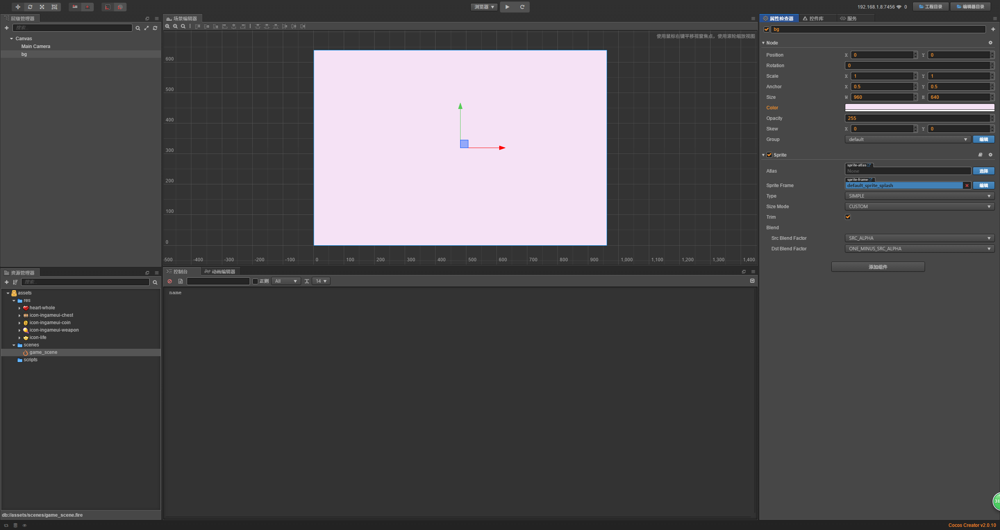 
        
2. 在学习前要了解个概念         
    1. 碰撞检测和物理碰撞是2个独立的模块
    2. 能在添加组件里发现这一点
        1. 添加组件->碰撞组件
        2. 添加组件->物理组件
3. 开始练习
    1. 首先要对游戏界的物体进行分组
        1. 拿射击类游戏举例子，比如游戏界里有以下几个物体
            1. 敌人
            2. 玩家
            3. 敌人的子弹
            4. 玩家的子弹
            5. 道具        
        2. 点击项目->项目设置
        
            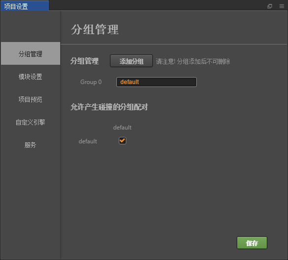
            
        3. 我们先加2个分组吧，一个是玩家一个是道具
            1. 点击**添加分组**，设置组名为**PLAYER**,这个代表的是玩家组
            2. 点击**添加分组**，设置组名为**PROP**，这个代表的是道具组 
            3. 注意看每个分组前面有index的值，default默认是0
            
                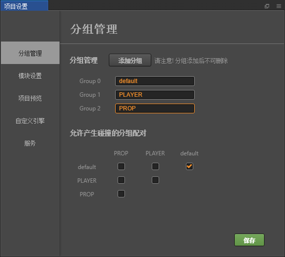
                
        4. 配置碰撞矩阵
            1. 碰撞矩阵就是下面的这个列表
            
                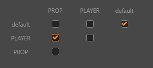  
            
            2. 翻译下这个列表什么意思
                1. 我们以可以勾选的每一行为例子    
                    
                    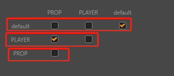    
                    
                2. 第一行可以解读为default和prop没有碰撞检测，default和player没有碰撞检测，default和default有碰撞检测
                3. 第二行可以解读为player和prop有碰撞检测，player和player没有碰撞检测
                4. 第三行可以解读为prop和prop没有碰撞检测     
                5. 允许碰撞的他们碰撞了才会发生点什么事，不允许碰撞的就算他们碰撞了也当无事发生    
    2. 创建我们的主角
        1. 把素材里**icon-ingameui-weapon**这个作为主角，拖拽到Canvas节点下，
            取名为player，并且配置分组PLAYER  
            
            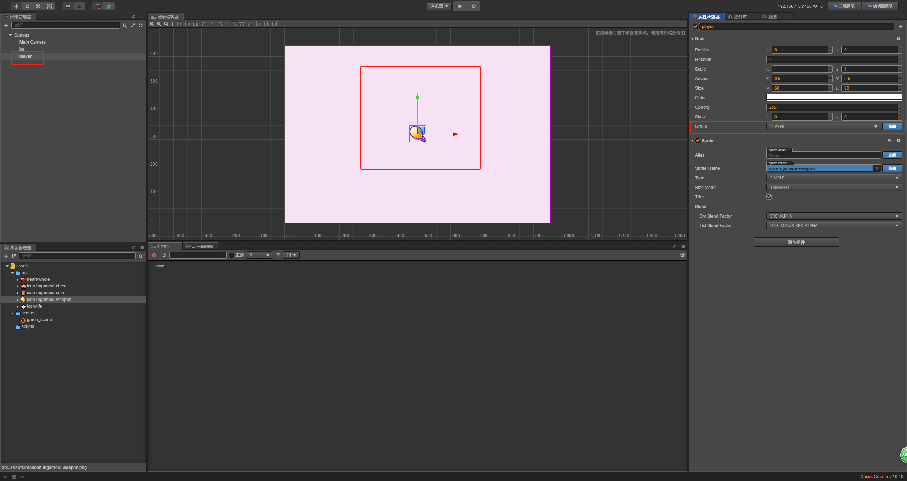    
        
        2. 在player下添加个碰撞器，这里添加个圆形碰撞器，在player属性检查器
            点击添加组件->碰撞组件->**Circle Collider** 
            
            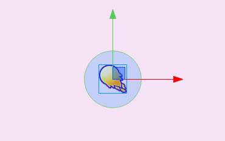      
            
        3. 我们来看下碰撞器属性
        
            
            
            * 选中**editing**属性，可以改变圆的大小，圆的位置
            
            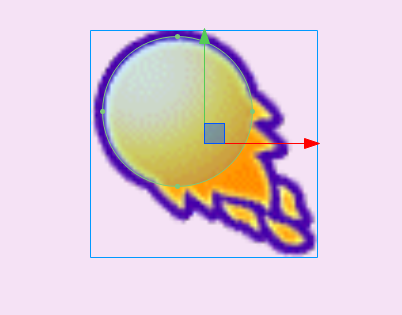
            
            * 在这里我们调整了大小然后正好移动到了主角的这个头部的位置作为碰撞的区域   
    3. 创建道具
        1. 爱心道具
            1. 拖拽爱心至Canvas下，随意移动个位置
            2. 配置分组**PROP**
            
                
            
            3. 添加碰撞器，因为是个不规则图形，这里添加多边形的碰撞器，
                点击添加组件->碰撞组件->**Polygon Collider**
                
            4. 老样子选中**editing**，然后拖拽边边角角，最后达到这个效果即可 
            
                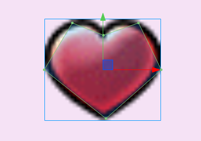
                
        2. 生命道具
            * 和上述步骤类似，该道具名称为life 
        3. 宝箱道具
            * 和上述步骤类似，该道具名称为box 
    4. 创建玩家移动的脚本
        1. 在玩耍前我们先调整下玩家的方向以及道具的位置
            1. 比如说玩家往右慢慢移动，依次碰撞我们创建的道具
            2. 先将玩家的头，方向改为朝右，这里使用旋转角度就可以了
            3. 将3个道具和玩家放在一条直线上
            4. 我们在层级管理器中，把player放在最下面，原因相信你们懂得
            
                
                
        2. 新建个**move.js**，在player下添加这个脚本 
        3. 这个是让player移动的脚本
        4. 在properties定义一个速度属性 
        5. 然后在update里编写我们的代码
            ```
            cc.Class({
                extends: cc.Component,
            
                properties: {
                    speed: 100,
                },
            
                // LIFE-CYCLE CALLBACKS:
            
                onLoad () {},
            
                start () {
            
                },
            
                update (dt) {
                	let speed = this.speed * dt;
                	this.node.x += speed;
                },
            });

            ```      
    5. 代码里开启碰撞检测
        1. 创建个新的脚本**enable_collider.js**,在Canvas下添加这个脚本
        2. 在properties里添加是否开启是否调试的属性
        3. 编写开启碰撞检测的代码
            ```
            cc.Class({
                extends: cc.Component,
            
                properties: {
                    is_enable: true,
                    is_debug: true,
                },
            
                // LIFE-CYCLE CALLBACKS:
            
                onLoad () {
                    if(this.is_enable){
                        let manager = cc.director.getCollisionManager();
                        manager.enabled = true; // 开启碰撞
                        if(this.is_debug){
                            manager.enabledDebugDraw = true; //绘制出物体的碰撞器形状
                        }
                    }
                },
            
                start () {
            
                },
            
                update (dt) {},
            });

            ```           
        4. 运行后能看到碰撞器的形状
            
                               
            
    6. 发生碰撞后怎么做 
        1. 首先碰撞就是物体间碰撞器的碰撞
        2. 原理
            1. 假设有A和B两个物体，他们都加了碰撞器的组件，
                然后A挂了A1和A2脚本
                然后B挂了B1和B2脚本
            2. 两个碰撞器碰撞了！
            3. 这个时候碰撞系统会去检测A和B的所有的脚本
                1. 对于A来说
                    * 检测A的所有脚本，A1里有没有碰撞函数，有则调用，A2里有没有碰撞函数，有则调用
                2. 对于B来说
                    * 和前面说的A一样，检测所有脚本，有没有碰撞函数，有则调用    
        3. 所以要在脚本里编写碰撞函数 
           * onCollisionEnter: function (other, self) // 开始(刚接触的时候)
           * onCollisionStay: function (other, self)  // 持续
           * onCollisionExit: function (other, self)   // 结束(分开的时候)
        4. 开始编写脚本
            1. 新建脚本**receive_prop.js**和**prop.js**
            2. **receive_prop.js**是挂在player下的，表示玩家碰撞(接受)道具时触发
            3. **prop.js**是挂在道具下的，表示道具被玩家碰撞(接受)时触发  
            4. A撞B，A的脚本里self就是A，other就是B，这里指的都是碰撞器组件 
            5. **receive_prop.js**的代码  
                ```
                onCollisionEnter: function (other, self){
                    console.log(other.node.name);
                    console.log(other.node.group);
                    console.log(other.node.groupIndex);
                },
                ```   
                
                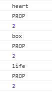    
                
            6. **prop.js**的代码，这里同样也copy上面的代码然后看下控制台，
                注意把前面的**receive_prop.js**打印语句注释掉，方便观察控制台
                
                     
            
            7. 我们先处理道具脚本**prop.js**碰撞后的逻辑
                ```
                onCollisionEnter: function (other, self){
                    // console.log(other.node.name);
                    // console.log(other.node.group);
                    // console.log(other.node.groupIndex);
                    if(other.node.groupIndex === 1){
                        //被玩家接收
                        this.node.removeFromParent();
                    }
                },
                ```
            8. 我们再处理玩家脚本**receive_prop.js**碰撞后的逻辑    
                ```
                onCollisionEnter: function (other, self){
                    // console.log(other.node.name);
                    // console.log(other.node.group);
                    // console.log(other.node.groupIndex);
                    if(other.node.groupIndex === 2){
                        //玩家捡到道具
                        console.log("我们捡到了" + other.node.name);
                    }
                },
                ``` 
            9. 运行~发现捡完道具后道具的确消失了而且控制台打印了这样的信息
            
                 
                
            10. 关于道具类型有更好的处理方式
                1. 我们在**prop.js**中的**properties**中添加属性**prop_type**,
                    这里其实是编辑器绑定了这个prop_type~ 
                    ```
                    properties: {
                        prop_type: 1,
                    },
                    ```  
                2. 这里我要霸气的截3个道具的属性图，编辑器绑定了属性当然就要把类型加上去了哈
                
                    
                    
                    
                    
                    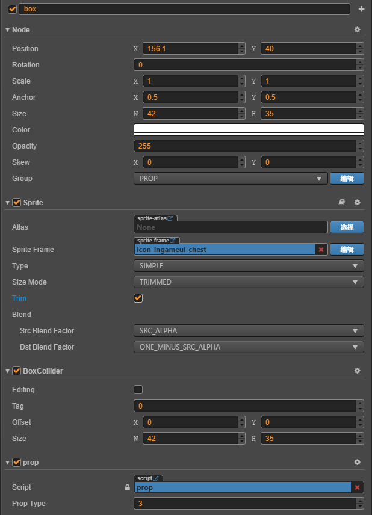
                    
                3. 改写**receive_prop.js**的碰撞函数 
                    ```
                    onCollisionEnter: function (other, self){
                        // console.log(other.node.name);
                        // console.log(other.node.group);
                        // console.log(other.node.groupIndex);
                        if(other.node.groupIndex === 2){
                            //玩家捡到道具
                            let prop = other.node.getComponent("prop"); //获取了prop组件就是prop.js
                            console.log("我们捡到了" + prop.prop_type);
                        }
                    },
                    ```
                    
                    
                       
                    
                                  