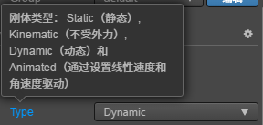
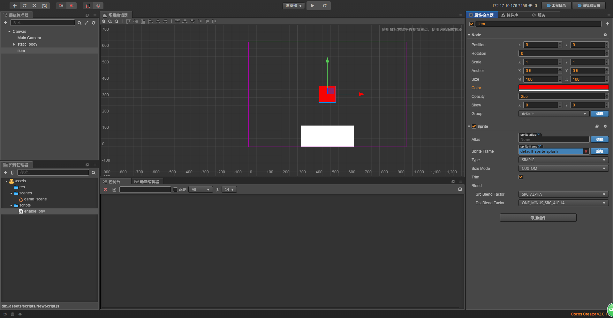
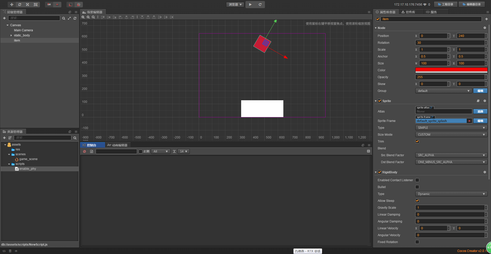
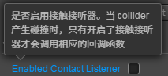
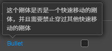
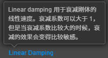
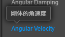

# 物理刚体

> 知识大纲
1. 刚体:形状不会改变
2. 刚体分为静态,动态刚体, 不受力的刚体(Kinematic,不受作用力的影响);
3. 刚体是受到物理作用的物体,由刚体带着节点移动;
4. 刚体组件cc.RigidBody:
      * enabledContactListener: 是否开启碰撞事件的监听;
      * bullet: 是否为子弹属性，防止高速穿越;
      * allowSleep: 是否允许进入休眠状态，一段时间后如果物体没有任何状态改变会进入休眠状态;
      * gravityScale: 该物体收重力的缩放;
      * linearDamping: 线性阻尼，衰减线性速度;
      * angularDamping: 角速度阻尼,衰减角速度;
      * linearVelocity: 刚体的线性速度;
      * angularVelocity: 刚体的角速度;
      * fixedRotation: 是否固定不旋转;
      * awake: 是否立刻唤醒此刚体;
      * active: 是否激活这个刚体，如果不激活，那么刚体不会参与碰撞;

> 练习
1. 原理
    * 首先请简单理解看下知识大纲的前2条
    * 刚体带着节点运动是什么鬼？
    * 这里可以举例说明，首先我们节点可能是个图片，图片里是个球
    * 然后我们在这个节点上绑定刚体组件
    * 这样引擎会计算好受到力的作用刚体会怎么动，从而带动这种图片在动
        这就是刚体带着节点移动的意思
2. 创建刚体
    1. 在Canvas下创建个空节点，取名为**static_body**    
    2. 然后在static_body的属性检查器中，添加组件->物理->RigidBody
        * 可以看下有以下这几个属性(在下面会详细的讲)
        
            
            
        * Type属性，这里我们选择静态的
        
            
            
    3. 然后我们会发现这个刚体没有任何形状，这个时候我们需要添加[刚体碰撞器](./04-刚体碰撞器.md),
        添加好就能看到形状了 
    4. 当然我们也可以在节点下挂一个图片节点或者单色精灵什么的，然后大小改为和刚体碰撞器的大小一致
    5. 然后移动下这个静态刚体的位置
        
        
        
    6. 这里要强调几个点
        * 首先static_body添加了物理引擎的脚本，这个说明这个节点参与物理碰撞   
        * 然后物理碰撞器是代表的物理碰撞时计算碰撞的大小位置
        * 最后挂的单色精灵，是挂在static_body下的，这里就是前面说的刚体带动节点 
        * 所以物理引擎管着刚体，刚体带着节点，所以这个节点会做物理运动
    7. 我们在创建个刚体，这里先新建个单色精灵，取名为item，给它上个色-红色  
        
        
    
    8. 添加刚体组件，type使用默认的动态    
    9. 添加物理碰撞器，依然选择box
    10. 把这个item刚体放到高处，旋转一定角度，然后运行看下吧，就能看到明显的物理运动了
    
        
        
3. 刚体组件的属性
    1. 前面已经简单看了下属性有哪些，这次细节的讲下
    2. Enabled Concat Listener
        1. 先来看下编辑器给的提示
            
               
        
        2. 默认是关闭的，要监听碰撞事件一定要勾选          
    3. Bullet
        1. 先来看下编辑器给的提示  
            
            
            
        2. 默认不勾选，简单的说就是能否穿过一个物体，防止高速物体穿越某个刚体
    4. Type前面已经简单使用过了
    5. Allow Sleep
        1. 先来看下编辑器给的提示
            
            
            
        2. 简单的说就是刚体运动后会休眠，
            我们前面的例子就是掉下来的刚体是在运动中的，掉在地上后就不动就会休眠，
            不勾选这个刚体就是永远不会休眠，会提高CPU占用率，一般我们都会勾选
    6. Gravity Scale
        1. 先来看下编辑器给的提示
        
            
            
        2. 最简单的说明就是演示，我们改成10以后刚体掉落就变快了，改成0.1的时候刚体掉落就变慢了
    7. Linear Damping  
        1. 先来看下编辑器给的提示
            
            
            
        2. 可以模拟阻力，这里的阻力是减弱线性的速度  
    8. Angular Damping
        1. 先来看下编辑器给的提示
        
             
            
        2. 可以模拟阻力，这里的阻力是减弱角速度
    9. linearVelocity 
        1. 先来看下编辑器给的提示
        
            
            
        2. 就是改变速度的，有X轴和Y轴的，这边我们演示可以在X轴上加个速度，然后你就能发现。刚体在X轴上做了飘动
            还可以用这个模拟抛物线运动，小伙伴可以把抛物线当练习题非常简单
    10. angularVelocity
        1. 先来看下编辑器给的提示  
        
                
            
        2. 就是改变角速度的，比方说一个没旋转过角度的矩形刚体，你给这个属性加了值，你就能看他旋转起来
    11. Fixed Rotation
        1. 先来看下编辑器给的提示  
        
            
            
        2. 只要勾选上，碰撞的时候不会旋转
    12. Awake On Load
        1. 先来看下编辑器给的提示  
            
             
            
        2. 这个提示已经够明确了，这里就不赘述了                       
                              
                
                    
                       
                  
