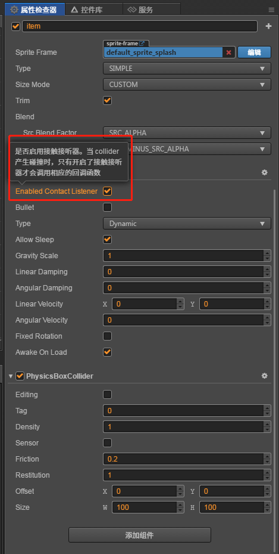
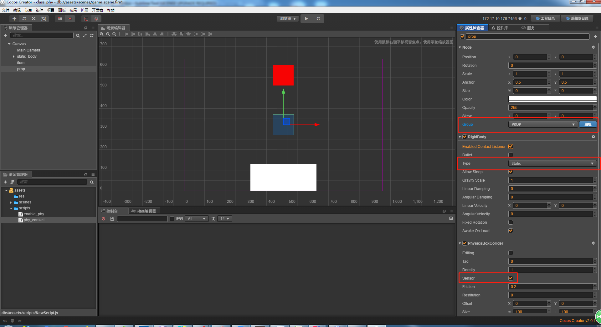
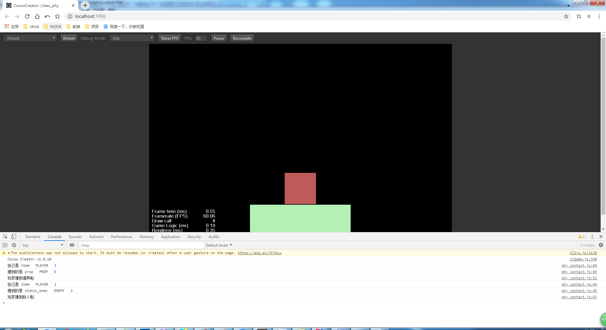

# 碰撞事件监听

> 知识大纲
1. 刚体组件开启碰撞监听;
2. 当有碰撞发生的时候,遍历刚体所在的节点所挂的所有的组件，
    看组件是否实现了碰撞检测函数，如果是，那么调用;
3. 在需要检测碰撞的组件代码里面编写碰撞响应函数:
     * onBeginContact ( contact, selfCollider, otherCollider): 碰撞开始
     * onEndContact (contact, selfCollider, otherCollider): 碰撞结束  
     * onPreSolve(contact, selfCollider, otherCollider); 碰撞持续,接触时被调用;
     * onPostSolve (contact, selfCollider, otherCollider);  碰撞接触更新完后调用,可以获得冲量信息
4.  如果把碰撞器设置成了sensor,那么只会做碰撞检测，而不会改变物体碰撞后的运动状态;
     * sensor: 用于触发器: 道具, 关卡的出口，入口等;
     
> 练习
1. 为了能够更好的模拟碰撞监听，这里修改下前面的自由落体item的碰撞器组件其中的一个属性**Restitution**,
    把他改为1，然后运行下就能看到item会上下弹跳了，就像琦玉老师的左右往返跳跃，这个就变成了上下往返跳跃
        
     

2. 刚体组件开启碰撞监听，指的就是勾选这个属性，要勾选了才能在开启监听

    
    
3. 新建脚本**phy_contact.js**脚本，先挂在item下   
4. 在**phy_contact.js**编写脚本
    1. 监听碰撞开始
        ```
        onBeginContact ( contact, selfCollider, otherCollider){
            console.log("碰撞开始")
        },
        ```      
    2. 监听碰撞结束
        ```
        onEndContact ( contact, selfCollider, otherCollider){
            console.log("碰撞结束")
        },
        ```
    3. 监听碰撞持续 - 这个用的不多
        ```
        onPreSolve ( contact, selfCollider, otherCollider){
            console.log("碰撞持续")
        },
        ```
    4. 监听碰撞持续结束 - 这个用的也不多   
        ```
        onPostSolve ( contact, selfCollider, otherCollider){
            console.log("碰撞持续结束")
        },
        ```
    5. 运行看控制台打印结果，因为我们的item是上下往返运动，所以
        
        
        
    6. 参数的学习
        1. contact
            * 是碰撞对象，本次碰撞的信息
        2. selfCollider
            * 对应的是自己的碰撞器组件
        3. otherCollider           
            * 对应的是别人的碰撞器组件(你撞到的是谁)
        4. 这样就能获取碰撞器所在的节点了，为了能看清信息，我们把前面的打印语句都注释掉  
            ```
            onBeginContact ( contact, selfCollider, otherCollider){
                // console.log("碰撞开始")
                console.log(contact);
                console.log("自己是 " + selfCollider.node.name);
                console.log("撞到的是 " + otherCollider.node.name);
            },
            ```
            
            
        
        5. 可以通过`node.group`和`node.groupIndex`获取分组信息
            ```
            onBeginContact ( contact, selfCollider, otherCollider){
                // console.log("碰撞开始")
                console.log(contact);
                console.log("自己是 " + selfCollider.node.name, " ", selfCollider.node.group, " ", selfCollider.node.groupIndex);
                console.log("撞到的是 " + otherCollider.node.name, " ", otherCollider.node.group, " ", otherCollider.node.groupIndex);
            },
            ```   
            
            
            
        6. 通过**groupIndex**可以添加自己想要的逻辑了 
            ```
            if(selfCollider.node.groupIndex == 1 && otherCollider.node.groupIndex == 2){
                console.log("玩家撞到敌人啦");
                //TODO 玩家撞到敌人后你想要怎么做，掉血，阵亡，还是让敌机阵亡我才是boss~哈哈
            }
            ``` 
            
                 
            
    7. 刚体间只做碰撞检测，但不改变运动状态，这里就要用**sensor**  
        * 一般传送门啊，道具啊之类的会设置为sensor
        * 理由很简单
            1. 玩家进入传送门，是不会被传送门一个巴掌弹回去的吧
            2. 玩家捡起道具，难道还要被道具揍飞嘛，道具此刻应该消失，进入玩家背包，
                和玩家发生碰撞但不会改变玩家的运动状态
            3. 这里就先举这2个例子
        * 我们在Canvas下创建个空节点，当做道具
            1. 记得改分组改为prop
            2. 挂一个物理碰撞器，这里发现挂了物理碰撞器自动也会挂上刚体这个组件
            3. 刚体type选为static，让道具静态不动
            4. 勾选**sensor** 
            
                 
                
            5. 把item的弹性系数改为0
            6. 修改下脚本的代码
                ```
                onBeginContact ( contact, selfCollider, otherCollider){
                    // console.log("碰撞开始")
                    // console.log(contact);
                    console.log("自己是 " + selfCollider.node.name, " ", selfCollider.node.group, " ", selfCollider.node.groupIndex);
                    console.log("撞到的是 " + otherCollider.node.name, " ", otherCollider.node.group, " ", otherCollider.node.groupIndex);
                    if(selfCollider.node.groupIndex == 1 && otherCollider.node.groupIndex == 2){
                        console.log("玩家撞到敌人啦");
                        //TODO 玩家撞到敌人后你想要怎么做，掉血，阵亡，还是让敌机阵亡我才是boss~哈哈
                    }
                    if(selfCollider.node.groupIndex == 1 && otherCollider.node.groupIndex == 5){
                        console.log("玩家撞到道具啦");
                        otherCollider.node.removeFromParent();
                    }
                },
                ```
            7. 运行，发现控制台打印的就是我们想要的，且道具被玩家捡好消失了
                
                    