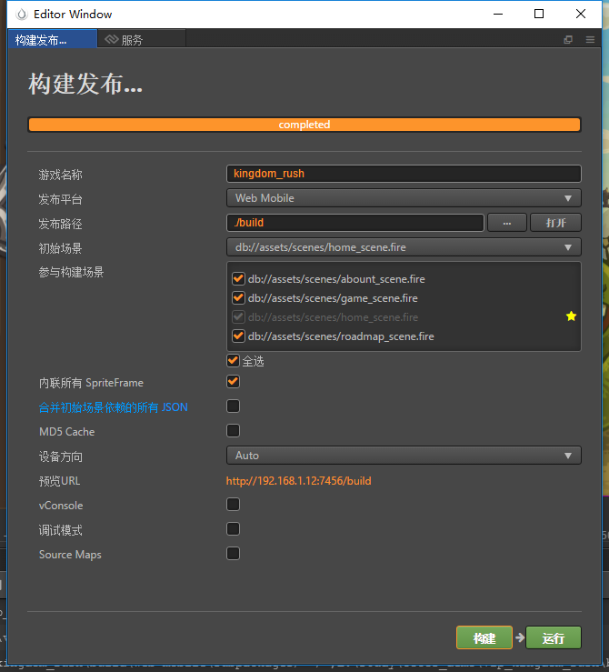

# h5打包发布

> 知识大纲
1. 引擎模块裁剪，减少引擎体积;
2. resources目录的特性，减少setting.js体积;
3. 订制启动的logo,与样式;  
4. resources特性
    * creator里面会根据场景的依赖来打包的我们的资源, 资源没有用的，将不会被打包进来;
    * 有时候我们需要代码加载我们的资源, cocos creator独立出来一个文件夹resources(必须是要写成resources)
    存放我们的资源;
    * 这个资源将会被视为代码里面会加载的资源;
    所以resources文件夹下的资源，不管你有没有在场景里面使用，都会被打包进去;
    * resources里面的资源的ID，将会被打包写入到setting.js;
5. 代码加载资源的基本原则:
    1. 如果一个资源，不在代码里面加载，那么我们一定不要把它放到resources目录下;
    2. 如果一个资源要在代码里面加载，那么我们一定要放在resource目录下;
    3. 不管怎么样resource下的所有资源都会被打包进去,如果是真的没有用到的资源，不要放到resource目录下;
    4. resources下的ID都会被写入setting.js导致setting.js 文件过大,我们要将没有在代码里面加载的文件移出
    resources目录
    
> 练习
1. 先把我们的game下的游戏解压，然后用creator打开    

    
    
2. creator能打包h5的也能打包安卓的，现在先学习打包H5的
3. 点击菜单栏项目->构建发布  
    
      

4. 修改构建发布的属性及发布后的玩耍~
    1. 游戏名称
        * 根据自己喜欢的来，自己做的游戏自己想起什么名字就起什么
    2. 发布平台
        * 我们选择Web Mobile
    3. 发布路径
        * 可以用默认的，指的就是build在当前项目的build文件夹下
    4. 初始场景
        * 指的是这个游戏第一个运行的场景是哪个
        * 需要的额外的场景可以勾选，这里我们选择全选
    5. 其他选择默认，然后点击构建，
        * 构建成功后是这个样子的
        
                
            
        * 可以在文件夹中找到
        
            
    
    6. index.html打开就可以运行我们游戏了，这里注意下，只支持火狐浏览器，其他浏览器不能直接运行
    7. 定制启动的logo和样式，这个是作为前端的老本行了，不多赘述
    
5. 如何优化
    1. 减少我们引擎的大小，js的文件越小，用户加载游戏越快
    2. 如何缩小引擎，点击菜单栏的项目->项目设置，然后选中模块设置
    
            
        
    3. 没有用的模块去掉就可以了，然后在构建发布  
    4. resources的特性，详情请看知识大纲  
                        
                        
