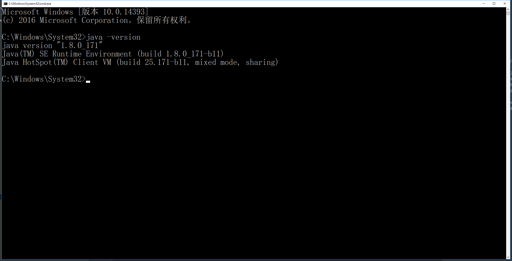

# 安装JDK

> 知识大纲
1. 运行JDK的安装包，一路next安装好JDK到默认的目录，不要擅自修改目录，把它安装到C盘;
2. 打开环境变量编辑器, 在系统变量里面添加:
    * JAVA_HOME: C:\Program Files\Java\jdk1.7.0_51(JDK的安装目录)
    * CLASSPATH: .;%JAVA_HOME%\lib;(注意点号表示当前目录,不能省略)
    * 在系统变量Path变量最前面添加 %JAVA_HOME%\bin;(注意:这里的分号不能省略)
3. 测试JDK是否已经安装好:  java -version  查看版本信息
4. 这里其实我之前装过java8了，所以jdk小伙伴自行安装，然后cmd看version信息，我这边的cmd是这样的

    

