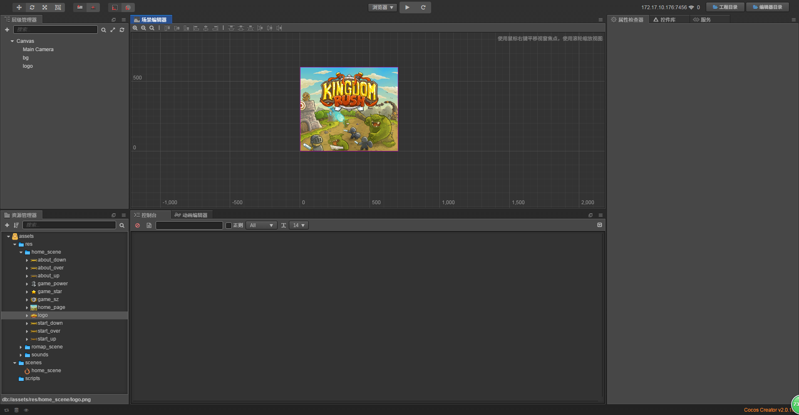
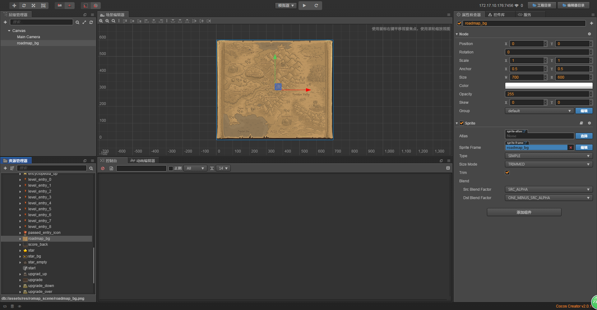
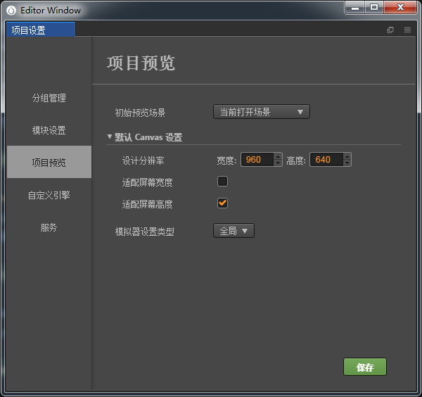
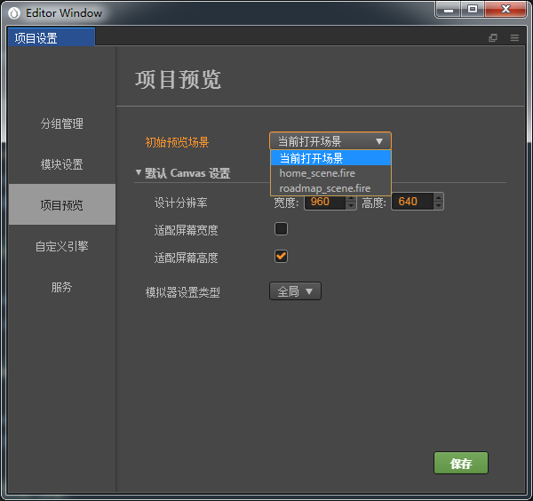

# 常用接口

> 知识大纲
1. getWinSize: 适配后的逻辑大小;
2. getWinSizeInPixels: 获取窗口的像素大小;
3. getScene: 获取当前的逻辑场景,场景对象下面是Canvas;
4. setDisplayStats: 是否显示左下角FPS信息;
5. getCollisionManager: 获取碰撞检测管理对象;
6. getPhysicsManager: 获取物理引擎管理对象;
7. loadScene: 加载场景,场景的名字，系统会加载对应的场景
8. preloadScene: 预加载场景

> 练习
1. [API文档](https://docs.cocos.com/creator/api/zh/classes/Director.html)
2. 新建项目，我们先做**home_scene**场景
    1. 先把Canvas的大小改为(700, 600)，因为我们这次演示的素材背景大小就是这个，然后保存场景为**home_scene**
    2. 把素材放入res文件中，在把home_scene文件夹中的home_page拖拽至Canvas节点下，改名为bg  
    
            
    
    3. 我们把home_scene文件夹中的logo也拖拽至Canvas下，然后调整下位置   
    
         
        
    4. 我们把home_scene文件夹中的start_up也拖拽至Canvas下，取名为start
        * 要修改下属性
            1. Size Mode选择Raw
            2. Trim不勾选
            3. 把按钮往下移，改变positionY的值 
        * 添加Button组件
            1. 把start节点拖拽至target属性
            2. Normal - start_up
            3. Pressed - start_down
            4. Hover - start_over
            5. Disabled - start_down
        * 效果应该是这样的
          
            
            
3. 接下来我们做个新的场景**roadmap_scene** 
    1. 在新建前记得先**Ctrl+S**保存下我们之前的**home_scene** 
    2. 点击菜单栏，文件->新建场景，然后**Ctrl+S**保存新场景，取名为**roadmap_scene** 
        
         
    
    3. roadmap_scene下的Canvas节点，分辨率依然还是要改为(700, 600)    
    4. 先把素材中roadmap_scene文件夹中的**roadmap_bg**拖拽至Canvas下   
    
            
 
4. 如何从第一个**home_scene**场景跳到第二个**roadmap_scene**场景
    1. 先说下，项目设置里有个东西，点击菜单栏，项目->项目设置，选择项目预览
    
           
        
    2. 初始预览场景，其实就是运行时会看到哪个场景，这里可以设置的
    
           
        
    3. 我们选择home_scene，就是不管你编辑器在哪个场景下，你运行后都是从home_scene开始
    4. 我们现在的需求应该就是点击开始按钮，让home_scene场景跳转至roadmap_scene场景
    5. 切换到home_scene场景，新建**game_scene**脚本，挂在home_scene的Canvas下，然后开始编写脚本
        1. 新建个方法用来跳转**roadmap_scene**
            ```
            goto_roadmap(){
                cc.director.loadScene("roadmap_scene");
            },
            ```            
        2. 找到start的属性检查器，绑定这个方法 
        
            
            
        3. 运行看下效果吧，点击开始跳转到地图了哈~啦啦啦
 5. 其他的API我就不一一演示了，小伙伴们自行尝试玩耍            
