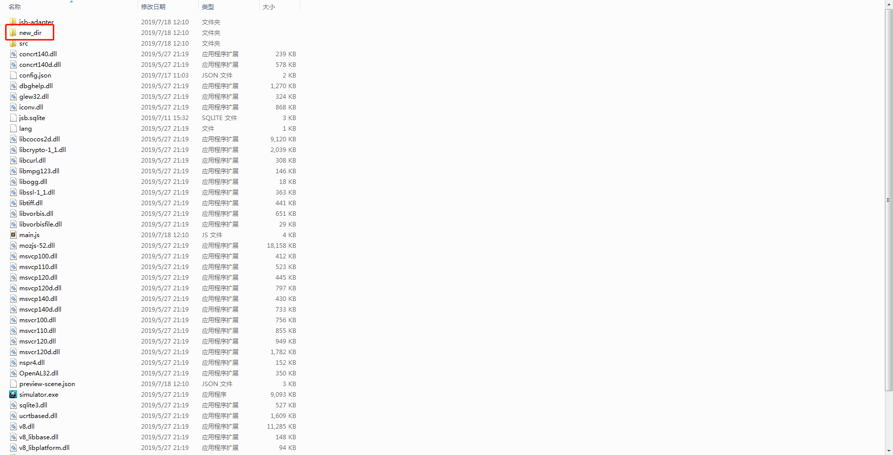
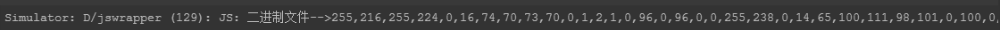

# FileUtils

> 知识大纲
1. jsb是javascript bind的代表，整个C/C++ 导出的绑定都在这个jsb里面,jsb 支持不支持h5;
2. FileUtils是本地文件读写的一个工具类,全局只有一个实例;
3. jsb.fileUtils来获取文件读写工具类的实例;
4. jsb.fileUtils.isDirectoryExist(path): 判断路径是否存在;
5. jsb.fileUtils.createDirectory(path); 创建一个路径;
6. jsb.fileUtils.getDataFromFile(path)获取二进制数据; // Uint8Array文本
7. jsb.fileUtils.writeDataToFile(data,path); 写二进制数据; // Uint8Array 对象
8. jsb.fileUtils.writeStringToFile(data,path); 写文本文件; // data String对象
9. jsb.fileUtils.getStringFromFile(path); 获取文本数据; // data String
9. jsb.fileUtils.removeFile(path); 删除掉一个文件;
10. jsb.fileUtils.getWritablePath(); 获取文件的可写目录,是一个内部存储的目录
    * 我们的手机OS会为每个APP分配一个可读写的路径，但是这个App如果卸载以后，这个数据也会被删除;
    * 如果你要想保存到本地有又是持久的，只要你有权限，你可以写入外部存储，外部存储的这个路径也是适用于
        fileUtils工具类的，且APP卸载后数据还在;
        
> 练习
1. 新建项目，新建**game_scene.js**脚本挂在Canvas下
2. 接下来就要使用jsb，注意h5是不能使用的，只能在native使用，所以我们这次练习运行都要用模拟器运行
    1. 先要获取文件的可写目录，并不是什么地方都能读写的  
        ```
        onLoad () {
            let writable_path = jsb.fileUtils.getWritablePath();
            console.log("可写路径是" + writable_path);
        },
        ``` 
        
         
        
    2. 这个就是我们模拟器的位置，如果是手机上，请看知识大纲第十条
    3. 接下来我们来创建一个我们想要的路径  
        ```
        onLoad () {
            let writable_path = jsb.fileUtils.getWritablePath();
            console.log("可写路径是" + writable_path);
            //要在可写的路径下创建文件夹，前面的打印路径最后是带着斜杠的
            let new_dir = writable_path + "new_dir";
            jsb.fileUtils.createDirectory(new_dir);
        },
        ```
        
         
        
    4. 判断文件夹是否存在，我们可以用这个来优化我们前面的代码 
    
        ```
        onLoad () {
            let writable_path = jsb.fileUtils.getWritablePath();
            console.log("可写路径是" + writable_path);
            //要在可写的路径下创建文件夹，前面的打印路径最后是带着斜杠的
            let new_dir = writable_path + "new_dir";
            if(!jsb.fileUtils.isDirectoryExist(new_dir)){
                //文件夹不存在则新建
                jsb.fileUtils.createDirectory(new_dir);
            }else{
                 console.log("文件夹存在啦")
            }
        },
        ```      
    5. 读写文件
        1. 文本文件
            1. 我们现在new_dir下新建个**test_str_read.txt**文本文件
                
                
            
            2. 在里面任意写点文本
            3. 我们开始写代码
                ```
                let str_data = jsb.fileUtils.getStringFromFile(new_dir + "/test_str_read.txt");
                console.log(str_data);
                ```
            4. 这样就能打印出我们前面写的文本了 
            5. 我们在写点东西进去
                ```
                str_data += " 我就是天才啊";
                jsb.fileUtils.writeStringToFile(str_data, new_dir + "/test_str_read.txt");
                ``` 
            6. 打开**test_str_read.txt**我是天才的确写进去了，看来我真的是天才~       
        2. 二进制文件
            1. 我们在new_dir下放个图片来读一读，随意找个图片然后改下名字
                
                  
                
            2. 具体代码是这样的
                ```
                let bin_array = jsb.fileUtils.getDataFromFile(new_dir + "/test_bin_read.jpg")
                console.log("二进制文件-->" + bin_array);
                ```   
                
                
            
            3. 写二进制文件，用的就是**writeDataToFile**
                * `jsb.fileUtils.writeDataToFile(bin_array, new_dir + "/test_bin_write.jpg");`  
                * 然后我们去看下目录
                    
                    
                
                * 把2张图片打开来看，果然一毛一样！！          
    6. 删除文件，删除文件夹
        1. 使用removeFile删除文件  
            * `jsb.fileUtils.removeFile(new_dir + "/test_bin_write.jpg");`   
            * 然后文件的确被删除了
        2. 使用removeDirectory删除文件夹
            * 这里就不演示了，小伙伴们自行调试       