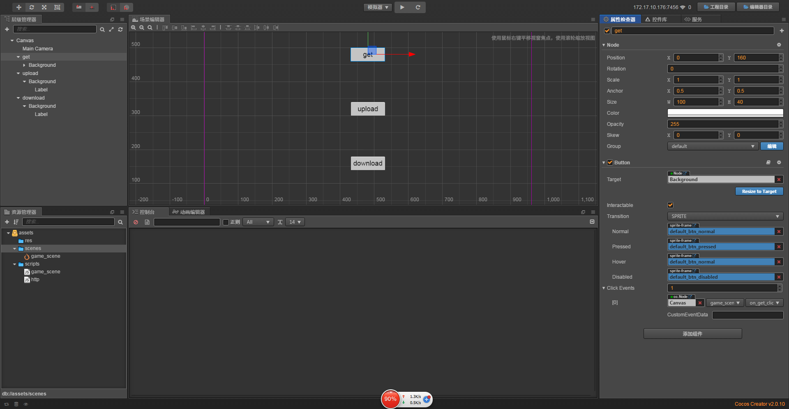
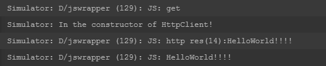
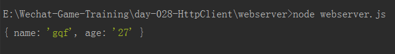

# HttpClient

1. Http Client: GET，POST是http的两种请求;
2. 获取网页数据我们一般使用http Get,GET传递参数通过?开始每个参数之间使用&来隔开;
3. 上传数据我们一般使用POST协议来上传;
4. download下载一般也用GET来做, xhr.responseType 指的是数据的类型:
    * "" -  (默认)DOMString 是一个UTF-16字符串, DOMString 直接映射到 一个String
    * "arraybuffer" -  对象被用来表示一个通用的，固定长度的二进制数据缓冲区
    * "blob" -  Blob对象表示不可变的类似文件对象的原始数据
    * "json" -  JavaScript object, parsed from a JSON string returned by the server
    * "text" -  DOMString
    * 根据你要获取的数据类型来决定，比如下载一个文件，可以采用arraybuffer模式;
5. 使用http.js里面的get请求;
6. 使用http.js里面的post上传文件数据;
7. 使用http.js里面的get下载文件,并保存到本地;

> 练习
1. 准备工作
    1. 新建项目后新建脚本**game_scene.js**, 挂在Canvas下
    2. 在脚本里新建3个方法，**on_get_click**,**on_upload_click**,**on_download_click**
        ```
        cc.Class({
            extends: cc.Component,
        
            properties: {
        
            },
        
            // LIFE-CYCLE CALLBACKS:
        
            onLoad () {},
        
            start () {
        
            },
        
            update (dt) {},
        
            on_get_click(){
                console.log("get");
            },
        
            on_upload_click(){
                console.log("upload");
            },
        
            on_download_click(){
                console.log("download");
            },
        });
        ```
    3. 我们在场景编辑器里做3个按钮，label分别为**get**， **upload**， **download**,然后绑定前面我们写的方法
    
         
        
    4. 我们可以先运行下，点击按钮，看下是否绑定到对应的方法上了，事实证明没什么问题
    
           

2. 服务器(后端)代码已经写好了，大家可以直接用，进入webserver目录，输入指令`node webserver.js`即可，源码小伙伴们自行研究
3. 前端也帮大家封装好了http.js，在scripts文件夹中，我们拷贝到res中的scripts文件夹，同样源码小伙伴自行研究
    * 在game_scene要引用这个http的模块
    * 具体代码 `const http = require("http");`       
4. get请求，一般获取数据都是用这个
    1. 编写代码
        ```
        on_get_click(){
            console.log("get");
            http.get("http://localhost:6080", "/get", "name=gqf&age=27", function(err, ret){
                if(err){
                    console.log(err)
                    return;
                }
                console.log(ret);
            })
        },
        ```
    2. 运行看结果
        1. 模拟器的控制台收到了服务器返回的消息
        
               
            
        2. 后端也收到了前端的信息 
        
                  
        
5. upload上传，上传一般用post
    1. 有个简单的准备工作
        * 这里在images里提供了个logo的图片
        * 在第26天的时候我们学习了[本地文件的读写](../day-026-本地文件读写/00-本章目录.md),里面介绍了什么是读写路径
        * 我们把logo图片放在读写路径下
        
            
            
        * 后端项目中有个upload的文件夹，为了测试我们要把里面的文件清空下    
            
    2. 编写代码
        ```
        on_upload_click(){
            // 测试只能在native平台
            
            let path = jsb.fileUtils.getWritablePath();
            let fileData = jsb.fileUtils.getDataFromFile(path + "logo.jpg");
    
            
            http.post("http://127.0.0.1:6080", "/upload", "name=upload_test.jpg", fileData, function(err, ret) {
                if(err) {
                    console.log(err);
                    return;
                }
    
                console.log(ret);
            });
        },
        ```
    3. 运行后看到图片的确上传成功~    

6. download下载，下载一般用get
    1. 需要指定数据类型arraybuffer
    2. 具体代码是这样子的
        ```
        on_download_click(){
            http.download("http://127.0.0.1:6080", "/download.jpg", null, function(err, data) {
                let path = jsb.fileUtils.getWritablePath() + "/download.jpg";
                jsb.fileUtils.writeDataToFile(data, path);
            });
        },
        ```
    3. 然后运行，就能把服务器上的图片下载到我们本地可读路径下了                        

    
